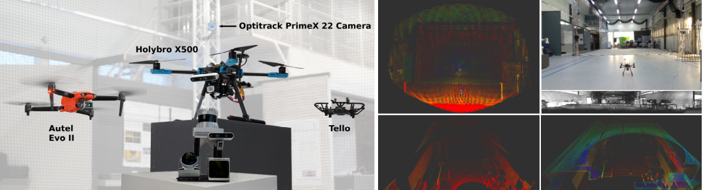

<div align="center">
    <h1>Towards Robust UAV Tracking in GNSS-Denied Environments: A Multi-LiDAR Multi-UAV Dataset</h1>
    <a href="https://github.com/TIERS/dynamic_scan_tracking/blob/main/LICENSE"></a>
    <a href="https://github.com/TIERS/uav_lidar_tracking_dataset/blob/main"></a>
    <a href="https://github.com/TIERS/uav_lidar_tracking_dataset/blob/main"></a>
    <a href="https://github.com/TIERS/uav_lidar_tracking_dataset/blob/main"></a>
    <br />
    <br />
    <a href="https://tiers.github.io/uav_lidar_tracking_dataset/">Project Page</a>
    <span>&nbsp;&nbsp;•&nbsp;&nbsp;</span>
    <a href="">Paper</a>
    <span>&nbsp;&nbsp;•&nbsp;&nbsp;</span>
    <a href="https://github.com/TIERS/uav_multi_lidar_dataset/issues">Contact Us</a>
  <br />
  <br />
  <p align="center">
    
  </p>

</div>

We present a novel multi-LiDAR dataset specifically designed for UAV tracking. Our dataset includes data from a spinning LiDAR, two solid-state LiDARs with different Field of View (FoV) and scan patterns, and an RGB-D camera. This diverse sensor suite allows for research on new challenges in the field, including limited FoV adaptability and multi-modality data processing. For a comprehensive list of sequences refer to the paper [Towards Robust UAV Tracking in GNSS-Denied Environments: A Multi-LiDAR Multi-UAV Dataset]() and the [project page](https://tiers.github.io/uav_lidar_tracking_dataset) 

<hr />

## Calibration 

We provide a ROS package to compute the extrinsic parameters between LiDARs and camera based on GICP. As the OS1 has the largest FOV, it is treated as base reference frame ("base_link") in which all the other point clouds are transformed. For the Avia, Mid-360 and Realsense D435, we integrated the first five frames to increase point cloud density.

To use this package, play teh Calibration rosbag in our dataset:
~~~
rosbag play Calibration.bag -l
~~~
Then run our calibration launch file:
~~~
roslaunch uav_lidar_dataset lidars_extrinsic_computation.launch
~~~

The computed extrinsic parameters will appear in the terminal:
~~~
OS -> base_link 0 0 0 0 0 0 /os_sensor /base_link 10
Avia -> base_link   0.149354  0.0423582 -0.0524961  3.13419 -3.13908 -3.13281 /avia_frame /base_link 10
Mid360 -> base_link   0.125546 -0.0554536   -0.20206 0.00467344  0.0270294  0.0494959 /mid360_frame /base_link 10
Camera -> base_link -0.172863   0.11895 -0.101785 1.55222 3.11188 1.60982 /camera_depth_optical_frame /base_link 10
~~~

## Install
The code has been tested on Ubuntu 20.04 with ROS Noetic

### Dependencies
- PCL

- Eigen

- Livox_ros_driver, Follow [livox_ros_driver Installation](https://github.com/Livox-SDK/livox_ros_driver).

### Build
```
  cd ~/catkin_ws/src
  git clone https://github.com/TIERS/uav_lidar_tracking_dataset
  cd ..
  catkin build
  ```

## Citation
If you use this dataset for any academic work, please cite the following publication:

```
@misc{catalano2023towards,
    title={Towards Robust UAV Tracking in GNSS-Denied Environments: A Multi-LiDAR Multi-UAV Dataset}, 
    author={Iacopo Catalano and Xianjia Yu and Jorge Pena Queralta},
    year={2023},
    eprint={},
    archivePrefix={arXiv},
    primaryClass={cs.RO}
}
```